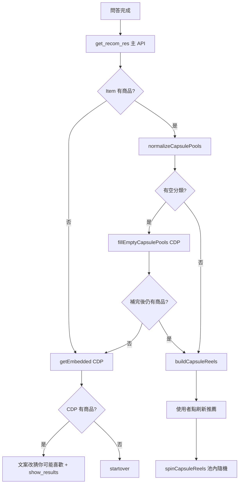

# 推薦商品邏輯

> 資料來源：`js/iframe.js`（主流程）、`js/embedded.js`（嵌入式輪播／優惠區熱銷）  
> 最後整理：2026-07-28

本文說明 no-media iframe 目前如何取得、補齊、呈現推薦商品。

---

## 總覽

使用者完成標籤問答後，前端以 **標籤推薦 API** 取得分類商品池，再以 **拉霸（capsule）** 呈現。若主結果為空或部分分類為空，會改打／補打 **CDP 備援推薦 API**。

另外，優惠券模態內的「熱銷」區塊會呼叫 `Product_Recommendation`（`embedded.js`），走另一套行為／社群證明推薦。

```
問答完成
  └─ get_recom_res()
       └─ POST 主推薦 API（Tags + capsule）
            └─ show_results()
                 ├─ 有商品 → normalizeCapsulePools →（空欄則 CDP 補齊）→ 拉霸 UI
                 └─ 全空   → getEmbedded() → CDP 備援 → 文案改「猜你可能喜歡」→ 拉霸 UI
```

---

## 1. 主推薦：標籤 → 拉霸商品池

### 觸發時機

`get_recom_res()`（節流 3 秒）在以下情況被呼叫：

- 最後一題選完標籤
- 介紹頁「開始」時，若本地已存完整作答紀錄且結果區尚未渲染

防重入：`isFetching === true` 時直接 return。

### 請求

| 項目 | 值 |
|------|-----|
| URL | `https://ldiusfc4ib.execute-api.ap-northeast-1.amazonaws.com/v0/extension/recom_product` |
| Method | `POST` |
| Body | 見下表 |

| 欄位 | 說明 |
|------|------|
| `Brand` | 當前品牌 |
| `Tags` | `tags_chosen`（各題選中的標籤；略過題會有 `Name: "example"` 佔位） |
| `NUM` | `8` |
| `capsule` | 一般品牌為 `true`；`AURASTRO` 為 `"材質"`（動態分類 key） |
| `SpecifyTags` | `{}` |
| `SpecifyKeywords` | `[]` |

成功後：

1. `postMessage({ type: "result", value: true })` 通知父頁
2. 快取 `firstResult`
3. `await show_results(response, true)`

同時會把本次路線作答從 `INFS_ROUTE_ORDER_{Brand}` 移到 `INFS_ROUTE_RES_{Brand}`（非 preview 模式）。

---

## 2. 結果正規化與空欄補齊

### `normalizeCapsulePools(response)`

依 `response.Item` 結構分流：

| `Item` 型態 | 行為 |
|-------------|------|
| **分組物件**（每個 key 的值皆為陣列，如 `Tops` / `Bottoms` / `Dresses`，或材質名） | 直接當成各欄商品池 |
| **扁平陣列**（備援熱門商品） | 依序輪流分到預設三欄：`Tops`、`Bottoms`、`Dresses` |

### `show_results(response, isFirst)`

1. 正規化得到 `pools`
2. **總數為 0 或無 response** → 呼叫 `getEmbedded()`，並清空 `INFS_ROUTE_RES_{Brand}`
3. **任一分類為空** → `fillEmptyCapsulePools(pools)`：
   - 打 CDP 備援拿到商品
   - 平均切塊填入空欄；仍無資料的欄位會被拿掉（不顯示空卡）
   - 補完後仍全空 → 再走 `getEmbedded()`
4. 有資料則：
   - 顯示 `#container-recom`
   - 設定 `reelCats` / `capsulePools` / `resList`
   - 索引歸零；釘選狀態：`isFirst` 時全清，否則沿用既有 pin
   - `buildCapsuleReels()` 渲染

---

## 3. CDP 備援推薦

主結果不足時使用，邏輯集中在：

- `fetchFallbackRecommendItems()`
- `getEmbedded()`
- `fillEmptyCapsulePools()`

### API

| 條件 | Base path |
|------|-----------|
| `Brand === "VER"` | `HTTP_stock_cdp_product_recommendation` |
| 其他 | `HTTP_inf_bhv_cdp_product_recommendation` |

完整 URL：`https://api.inffits.com/{path}/extension/recom_product`

### Request body（`buildCdpRecommendRequest`）

| 欄位 | 一般（primary） | 備援（backup） |
|------|-----------------|----------------|
| `Brand` / `LGVID` / `MRID` / `GVID` | 當前使用者識別 | 同左 |
| `recom_num` | `"12"` | `"12"` |
| `PID` | `""` | `"搭配商品的pid"` |
| `SP_PID` | `"skip"` | `"xxSOCIAL PROOF"` |
| `series_in` | 僅 VER：依標籤名稱含「男／女」推性別，多者勝出；平手則不帶 | 同左 |

### 資料源選擇

```
bhv 有資料 → 用 bhv
否則       → 用 sp_atc
```

再經 `formatCdpItemsToCapsule`：隨機最多取 6 筆，並映射為拉霸欄位格式（`Imgsrc` / `Link` / `ItemName` / 價格等）。

### 兩段請求

1. 先打 primary（`SP_PID: skip`）
2. 若回傳長度為 0 或拋錯 → 再打 backup（社群證明）

### `getEmbedded()`（全無結果時）

- 成功：文案改為「猜你可能喜歡」／「目前無符合結果，推薦熱門商品給你。」，再 `show_results({ Item: formatItems })`
- 失敗或仍無商品：觸發 `#startover` 重來

### 空欄填補（`fillEmptyCapsulePools`）

對每個空分類，從備援陣列依 cursor 輪詢切出約 `floor(總數 / 空欄數)`（至少 1）筆填入；原本有商品的欄位保留不動。

---

## 4. 拉霸 UI 行為

| 能力 | 說明 |
|------|------|
| 欄位 | 依 `reelCats` 動態建立（預設三欄或 AURASTRO 材質 key） |
| 釘選 | `.reel-pin-btn` 切換 `capsulePinned[cat]`；釘選欄不參與轉動 |
| 刷新推薦 | `#recommend-btn` → `spinCapsuleReels(reelCats)`（**不重打主 API**，只在現有池內隨機） |
| 轉動 | 未釘選且池非空的欄；每欄隨機選一筆 `finalIdx`，欄與欄錯開 110ms |
| 動畫 | 10 張隨機填充圖 + 最終圖，easeOutExpo，約 1150–1450ms |
| 價格 | `showOriginPrice` 為真顯示原價，否則優先特價 |
| 點商品 | GA 事件 + 一般開連結；`omo_v1` 則 `postMessage` 開詳情 |

首次 `show_results(..., true)` 只建欄位與第 0 筆靜態顯示；使用者按「刷新推薦」才開始 spin。

---

## 5. 嵌入式推薦（`embedded.js`）

`window.Product_Recommendation(config)` 用於商品頁／優惠區輪播，與拉霸主流程獨立。

iframe 內在 `fetchCoupon` 成功後會以 `containerId: "hot-sale"` 等方式呼叫，並常設 `hide_discount` / `hide_size`。

### 請求

| 項目 | 值 |
|------|-----|
| URL | `https://gha6kqf5ff.execute-api.ap-northeast-1.amazonaws.com/v0/extension/recom_product` |
| 主要欄位 | `Brand`、`LGVID`、`MRID`、`GVID`、`recom_num: "6"`、`PID`（當頁 SKU）、`SP_PID: "skip"` |
| 可選 | `SIZEAI: "True"` + `bid`（未 `hide_size` 時） |

### 商品選取

1. 若有 `SIZEAI_result`：算出各商品最佳尺寸寫入 `size_tag`
2. 資料源：`bhv` 非空用 `bhv`，否則 `sp_atc`
3. 若傳入 `customEdm` 則直接用；否則從資料源隨機抽最多 6 筆
4. 顯示門檻：寬度 > 992 需 ≥ 6 筆；否則 ≥ 4 筆才顯示容器

失敗時會回退到簡化版 intro（`intro-content-simple`）。

---

## 6. 決策流程圖



---

## 7. 相關檔案與常數速查

| 符號／函式 | 檔案 | 角色 |
|------------|------|------|
| `get_recom_res` | `iframe.js` | 主推薦請求 |
| `show_results` | `iframe.js` | 正規化、補齊、渲染入口 |
| `normalizeCapsulePools` | `iframe.js` | Item → 分類池 |
| `fetchFallbackRecommendItems` | `iframe.js` | CDP 兩段備援 |
| `getEmbedded` | `iframe.js` | 全空時的熱門備援 |
| `spinCapsuleReels` | `iframe.js` | 刷新＝池內轉動 |
| `Product_Recommendation` / `getEmbeddedAds` | `embedded.js` | 嵌入輪播推薦 |
| `DEFAULT_REEL_CATS` | `iframe.js` | `["Tops","Bottoms","Dresses"]` |

GA 事件對應見 [gtag-events.md](./gtag-events.md)（`click_refresh_recommend`、`spin_capsule`、`click_reel_item` 等）。
